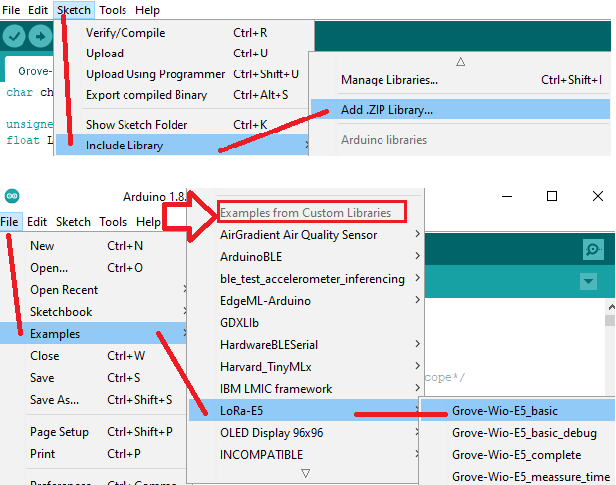
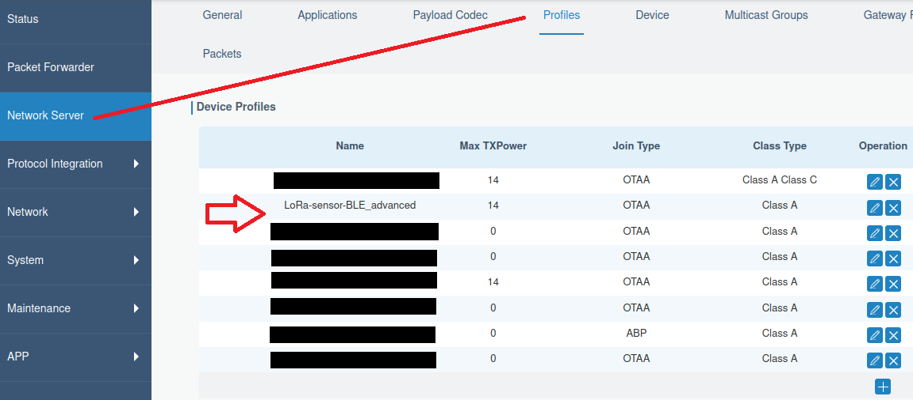
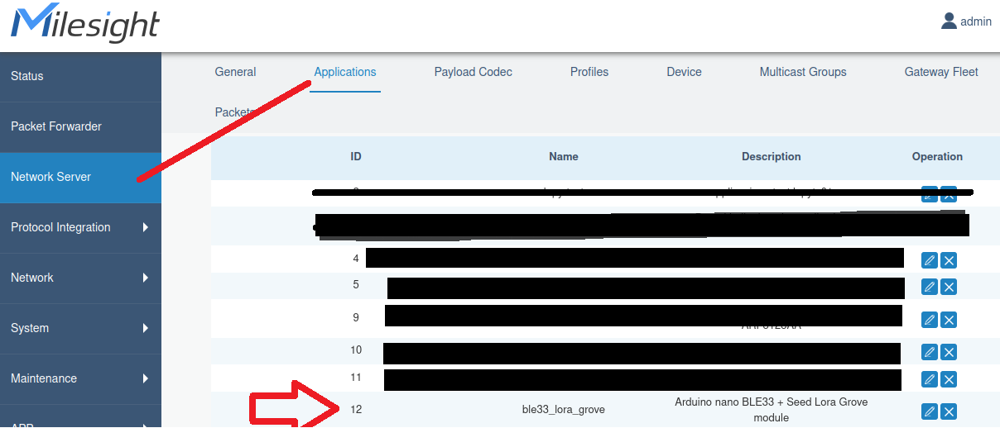
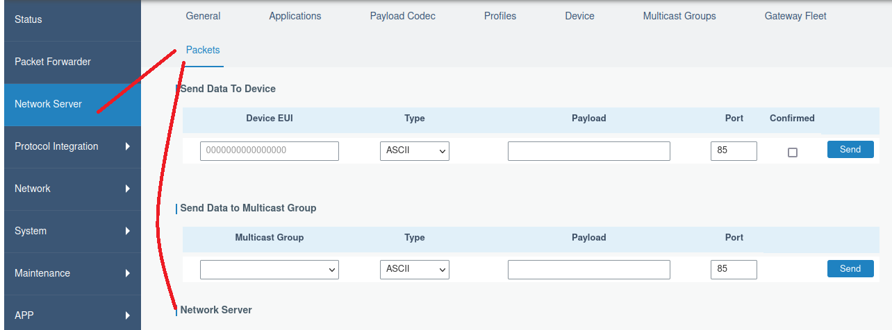
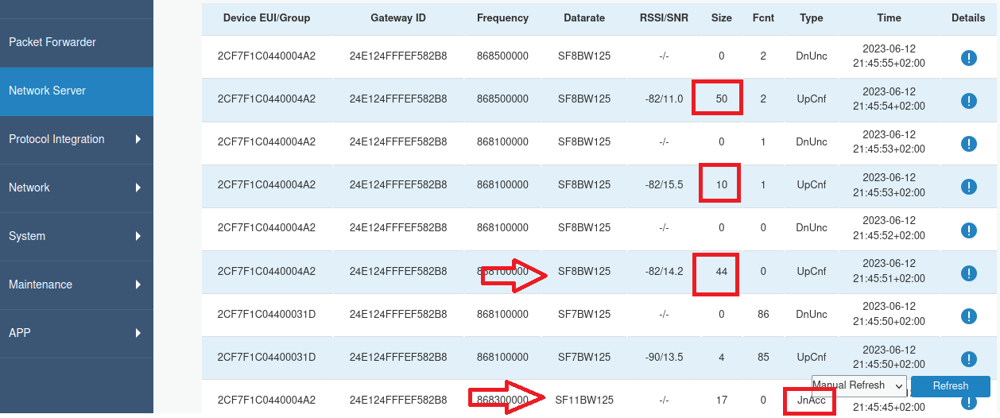

# LoRa-E5 Library
This is a LoRa Arduino library created in order to allow the user an easy, clear and safe interaction with the [SeeedStudio LoRa module Grove-Wio-E5](https://wiki.Seeedstudio.com/Grove_LoRa_E5_New_Version/) based on chip [STM32WLE5JC from STM](file:///C:/Users/marconiadm/Downloads/stm32wle5jc-2.pdf).
&nbsp;
This work was done in order to be used as both an educational tool for those who are doing their first steps into LoRa and also prepared for the ones looking for using this module in low-power projects.
&nbsp;
 

### Easy install and start

* Download this repository
* Open your Arduino IDE. Go to Sketch-> Include Library -> add.zip library... .Then select your LoRa-E5-main.zip file in your 
* Go to File-> Examples. Scroll down until you find "Examples for Custom Libraries". Below you should find "LoRa_E5". Select Grove-Wio-E5_basic to start.

&nbsp;

&nbsp;

&nbsp;

&nbsp;

### Important remark:
#### If you plan to use this libary with more than 5 devices sending information to the same gateway, use the function "TransmitePacket"  ( not the "TransmitePacketWithConfirmed" used in the examples) functions to avoid generating a bottle neck in the network.

## Features:

This project features a LoRa library that allows to perform a complete configuration of the [Seeed's Grove-Wio-E5](https://wiki.Seeedstudio.com/Grove_LoRa_E5_New_Version/) according to the user needs.
This LoRa library is based on the [Ramin Sangesari work](https://github.com/idreamsi/LoRaE5) (to whom I am very grateful) with some major modifications in order to allow the device to detect a correct command reception in a more flexible way, optimize the performance and add some useful functionalities (see the key features below) like software serial compatibility with boards like Arduino Nano 33 BLE Sense. Is important to know that Ramin Sangesari's work (and therefore, this library) supports P2P communication between LoRa node devices, which means that communications happen directly between both end node devices without any Gateway involved in the communication.
### Key features added:
* NEW V1.1.3: Added automatic Serial port turn on/off when automode=true to save power from Arduino module. This means that the power consumption when the software is not transmitting or receiving messages will be 21 uA (which is the power consumption of the LoRa module when automode=true and the module is doing nothing).
* NEW V1.1.3: Tested and verified support for XIAO ESP32S3 board!.
* Allows to make the use of SoftwareSerial (or Software UART) on boards like Arduino Nano 33BLE Sense. This is useful if you are using a Grove shield that uses your main serial and you need to use other pins of your board as a Serial interface to communicate with the Grove-Wio-E5 module.
* Support automatic Baud Rate detection and Baud Rate set-up over the module.
* Added examples of how to use the low power mode of the device and added a wakeUp function.
* Added full support to low-power auto mode. This mode works in the following way: once you set it, the LoRa module enters into a deep sleep (21 uA when powered with 3.3V) automatically and wakes up if a command is sent to the module or the module should wake up for a Rx window after sending a message to the gateway. So there will be no need to call lora.setDeviceLowPower().
* Allows to display commands sent, the responses from the Grove-Wio-E5 module and enable/disable the print of them. Also allows the device to measure the time it took to both send the command and receive a response from Grove-Wio-E5 (and gateway ACK if there is a need for that). You can also enable or disable the printing of the command messages. This means that you can run the code with your debugging serial terminal disabled.
* Supports the direct setup of Spread Factor and Bandwidth (if supported by your chosen Frequency Band).
* Allows the use of the different debug modes (DEBUG/INFO/WARN/ERROR/FATAL/PANIC/QUIET).
* Allows to estimate the time that is going to take to send a message based on your selected DR (or combination of Spread Factor and BandWidth) and LoRaWAN Frequency band (like EU868).
* Allows the user to estimate the amount of power used to send a message based on transmission power, periodicity and amounts of bytes. This estimation is made considering the ACK response from the gateway and considers the LoRa module sleep current (21 uA). This means, that if you don't transmit information, your power consumption will be 21 uA because of the sleep current of the module. The power consumption estimation uses the results of measurements made with the LoRa module powered with 3.3V. 
* Added an example to change the DevEUI of the device in order to make the testing of different codes simpler when interacting with a LoRa Gateway.IMPORTANT: When you change the DevEUI, this change will last even if you turn off the device, so be aware of what you are doing.
* Added examples to perform a transmission power Sweep and Spread factor Sweep, featuring tested examples working in low power mode using the Low Power Automode feature and packet transmission with ACK. 
## Hardware Setup:
For running this library you will need an Arduino board and a [Grove-Wio-E5 module]([https://www.Seeedstudio.com/Grove-LoRa-E5-STM32WLE5JC-p-4867.html?queryID=a5c3fb3bdd44e3b95c1c06bfd316bc1a&objectID=4867&indexName=bazaar_retailer_products](https://www.Seeedstudio.com/Grove-LoRa-E5-STM32WLE5JC-p-4867.html)). You can find [in this project](https://github.com/andresoliva/Grove-Wio-E5) how to connect your Arduino to the Grove-Wio-E5 in case you don't have a Grove expansion board. Also, all of the included examples explain how to specify the Tx and Rx pins of your Arduino in order to connect it to the Grove-Wio-E5 module.
## LoRa library important configuration:
Here are listed some parts of the project files (inside LoRa.h) that allows you to change the default configuration of the library and some of the examples included.
#### LoRa.h 
```html
/*--------------PRINT TIME --------------------------*/
/*Define to print to the USER into UART terminal the commands messages sent and response received */
#define COMMAND_PRINT_TO_USER
```
## Proyect important configuration:
Inside Grove-Wio-E5_advanced.ino
#### Custom DevEUI
* IMPORTANT: Once you set DeVEUI, unless you call a system default command, it will reamin the changed after the reset.
```html
/*To set a custom DEVUI if needed for facilitate testing*/
#define LoRa_DEVEUI_CUSTOM "2CF7F1C0440004A2" //Custom key for this App.
```
#### Print messages in the main project 
```html
#define PRINT_TO_USER                   /*To allow the printing of characters using UART*/
```
#### Print difference in transmission time based on packet payload size (see Example brief explanation:)
```html
#define PRINT_TO_USER_TIME_difference /*To allow the printing of time difference message*/
```
#### Debug mode
```html
#define LORA_DEBUG_AND_PRINT          /*Enables the debug mode of the device and allows serial printing of the content*/
```
## Example brief explanation:
The implemented example consists of:
* A complete set-up of the device in order to work with a EU868 LoRa Gateway in OTA mode. So you must add the DevEUI and settled AppKey of your device to the gateway in order to work like it was done in [SeeedStudio's original example](https://wiki.Seeedstudio.com/Grove_LoRa_E5_New_Version/#ttn-console-configuration-setup).
* The device will not send any packet until it joins the network. And this will only happen if you set your device properly to communicate with your Gateway by selecting the same Frequency band and configuring in the Gateway the DevEUI and settled AppKey.
* A loop transmission of one string packet (with port 7) and two hex packets (with port 8). The use of different ports allow the Gateway to decode the packet contents according to the content (bytes or string)
* A comparison between the expected differences in time when transmitting messages with 10 and 50 bytes of payload.
* Entering Low Power and Wake up functions to optimize performance.
* NEW!: Added Power and Spread factor Seeps example featuring the use of LowPowerAutomode function, which has proved to be more efficient in terms of power consumption compared to calling Low Power and Wake up functions.
### Commands expected responses
Here goes a list of what you should be seeing in your terminal based on this project configuration. You can see the [Grove-Wio-E5 commands list](https://files.Seeedstudio.com/products/317990687/res/LoRa-E5%20AT%20Command%20Specification_V1.0%20.pdf) for more information (and a better explanation).
#### Initial set Up

```html
--------Command sent:
AT+DR= EU868
--------Command responses:
+DR: EU868
--------End of Commands responses
Total Command Time + Time to get ACK response: 107 ms.
--------Command sent:
AT+DR=4
--------Command responses:
+DR: DR4
+DR: EU868 DR4  SF8  BW125K 
--------Command sent:
AT+CLASS=A
--------Command responses:
+CLASS: A
--------End of Commands responses
Total Command Time + Time to get ACK response: 32 ms.
--------Command sent:
AT+PORT=8
--------Command responses:
+PORT: 8
--------End of Commands responses
Total Command Time + Time to get ACK response: 10 ms.
--------Command sent:
AT+POWER=14
--------Command responses:
+POWER: 14
--------End of Commands responses
Total Command Time + Time to get ACK response: 13 ms.
--------Command sent:
AT+CH=2
--------Command responses:
+CH: 2
--------End of Commands responses
Total Command Time + Time to get ACK response: 9 ms.
--------Command sent:
AT+ADR=OFF
--------Command responses:
+ADR: OFF
--------End of Commands responses
Total Command Time + Time to get ACK response: 18 ms.
```

#### Get Device DevEUI
```html
Current DevEui:
+ID: DevEui, 2C:F7:F1:C0:44:00:04:A1
```

#### Join failed
```html
--------Command sent:
AT+JOIN
--------Command responses:
+JOIN: Start
+JOIN: NORMAL
+JOIN: Join failed
+JOIN: Done
--------End of Commands responses
!!Command Failed!! Did not get the expected "Ok" or "ACK" response from E5 module after sending the command.
```

#### Join ok
```html
--------Command sent:
AT+JOIN
--------Command responses:
+JOIN: Start
+JOIN: NORMAL
+JOIN: Network joined
--------End of Commands responses
Total Command Time + Time to get ACK response: 6585 ms.
```

#### Send String packet and waits for ACK
```html
Sending 44 characters to a LoRa Gateway and waits for ACK
--------Command sent:
AT+CMSG="I am sending this message to a LoRa Gateway."
--------Command responses:
+CMSG: Start
+CMSG: Wait ACK
+CMSG: ACK Received
+CMSG: RXWIN1, RSSI -82, SNR 10.0
+CMSG: Done
--------End of Commands responses
Time to Transmit message and Recieve ACK from TX message: 1277 ms.
Total Command Time + Time to get ACK response: 1376 ms.
```

#### Send Binary packet and waits for ACK
```html
Sending 10 bytes to a LoRa Gateway and waits for ACK
--------Command sent:
AT+CMSGHEX="00010203040506070809"
--------Command responses:
+CMSGHEX: Start
+CMSGHEX: Wait ACK
+CMSGHEX: ACK Received
+CMSGHEX: RXWIN1, RSSI -82, SNR 10.0
+CMSGHEX: Done
--------End of Commands responses
Time to Transmit message and Recieve ACK from TX message: 1192 ms.
Total Command Time + Time to get ACK response: 1303 ms.
```

#### DEBUG ON Send Binary packet and waits for ACK
```html
Sending 10 bytes to a LoRa Gateway and waits for ACK
--------Command sent:
AT+CMSGHEX="00010203040506070809"
--------Command responses:
+LOG:  WARN  7729182 LW      tx 8, 00010203040506070809(10)
+CMSGHEX: Start
+CMSGHEX: Wait ACK
+LOG: DEBUG  7729183 LW      ch 00
+LOG: DEBUG  7729183 LORA    TX, 868100000, SF8, 125KHz, 8, 14
+LOG: DEBUG  7729183 LORA    TX, 8080E43806000A00087F55A49CBBA871DA154AFF294815
+LOG: DEBUG  7730298 LORA    RX, 868100000, SF8, 125KHz, 14
+LOG: DEBUG  7730386 LORA    RX, 6080E43806A00A00672972FA, -88, 10
+CMSGHEX: ACK Received
+CMSGHEX: RXWIN1, RSSI -88, SNR 10.0
+CMSGHEX: Done
--------End of Commands responses
Time to Transmit message and Recieve ACK from TX message: 1199 ms.
Total Command Time + Time to get ACK response: 1374 ms.
```

#### Enable time comparison between 10 bytes and 50 bytes messages
```html
Estimated transmission time of messages with 10 and 50 bytes as payload: 108.0 ms, 210.4 ms.
Calculated time difference between transmitting 10 and 50 bytes as payload: 102.4 ms.
Measured difference between transmitting with 10 and 50 bytes as payload: 102.4 ms.
```

## Gateway Configuration to allow interaction.
As has been seen in the [Seeedstudios's Grove_LoRa-E5 examples](https://wiki.Seeedstudio.com/Grove_LoRa_E5_New_Version/#ttn-console-configuration-setup), in order to allow your Gateway to interact with your device (this means, to connect to the LoRaWAN network), you first need to make some setups in the Gateway. This tutorial will cover how to make this when your device is in OTA mode.

### Enter the gateway

Depending on the gateway. For example, if your gateway is already configured with [thethingsnetwork](https://www.thethingsnetwork.org/), you can follow the Seeedtutorial.

In my case, I am working on a Milesight UG67 Gateway working on the EU868 Band. This gateway is not connected to the internet, but it generates a local WiFI network, so in order to enter the gateway we need to:
 * Connect your PC to the WI-FI network generated by the Gateway (Gateway_F)
 * Type the Gateway address (192.168.1.1) and log in using the admin and password of the gateway.

### Add your device to the gateway
Before adding our device to the gateway, which will allow our LoRa module to join the network, we need to set up other fields first.

#### Create your device profile
 


 

#### Application
This field is used to tell the gateway how to interact. We will not use it in this tutorial, so we will leave it blank for future applications. So, just add your application with the desired name.
&nbsp;
&nbsp;
&nbsp;
#### Payload Codec
This field tells the Gateway how to convert the information received in the payload into human-readable information.
 

We insert this json code in order to decode the packets.
```html

function Decode(fPort, bytes) {
function bytesToHex(byteArray) {
var hexString = '';
for (var i = 0; i < byteArray.length; i++) {
var hex = byteArray[i].toString(16);
hex = (hex.length === 1) ? '0' + hex : hex;
hexString += hex;
}
return hexString;
}
function bytesToString(byteArray) {
var hexString = '';
for (var i = 0; i < byteArray.length; i++) {
var CHAR = String.fromCharCode(byteArray[i].toString());
hexString += CHAR;
}
return hexString;
}

var msg = {};
msg._payload_hex = bytesToHex(bytes);
//decodes the object and generates string
  if (fPort === 8) {
    var decodedtemp = bytes[0] <<8 | bytes[1];
    var decodedhumi = bytes[2] <<8 | bytes[3];
    msg.temperature_degrees=decodedtemp;
    msg.humidity_percent=decodedtemp;
  }
  //decodes the object and generates string
  if (fPort === 7) {
    msg._string=bytesToString(bytes);
  }
msg.info = LoRaObject;

return msg;
}
```

#### Adding your device
At last, we can add our device. Remember that you will need all the names of the profile, application and payload Coded we created before, plus adding the DevEUI and APPKey. How to obtain the last ones was explained at the beginning of this tutorial.
&nbsp;

AppKey value: 2B7E151628AED2A609CF4F3CABF71588
&nbsp;

DevEUI value: Get it by looking at your serial terminal! In the "Grove-Wio-E5_basic" example you can look at the DevEUI of your device each time the device fails to join the network.
&nbsp;

With this information and the work done so far, you should be able to fill all the listed fields in order to add your device to the Gateway, as seen in the following picture:

 

### Network joined and packet Reception
To verify if the device has joined the network and successfully sent a packet, go here:
&nbsp;
&nbsp;
 

#### Check the content of the packets and the decode functions
You can also go to packets and see the content received
 
 
&nbsp;
A packet with binary content (Port 7):


&nbsp;
A packet with string content (Port 8):

 

# To test:
  * Re-test P2P communication after library rework.
